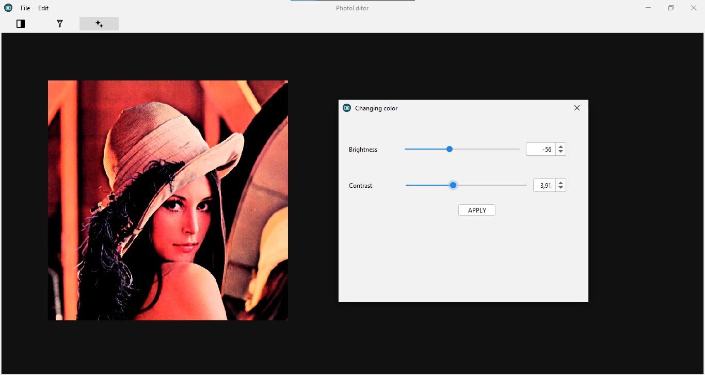
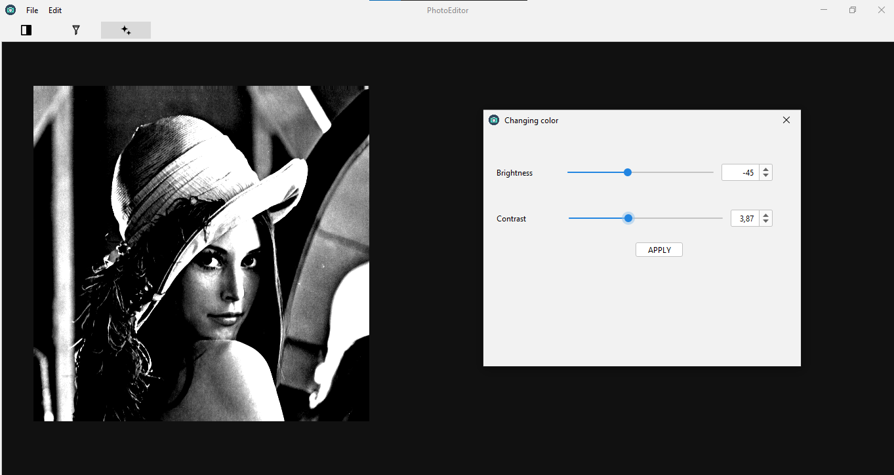
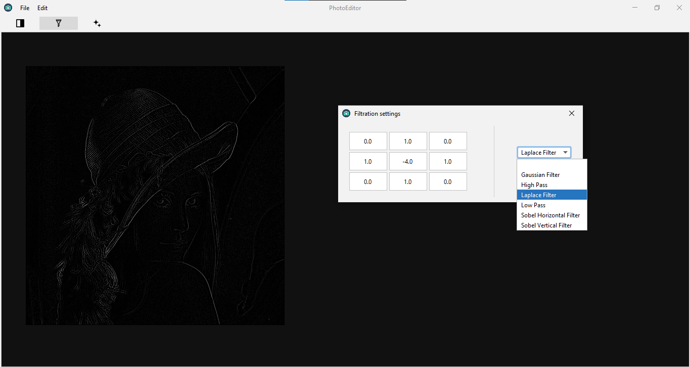
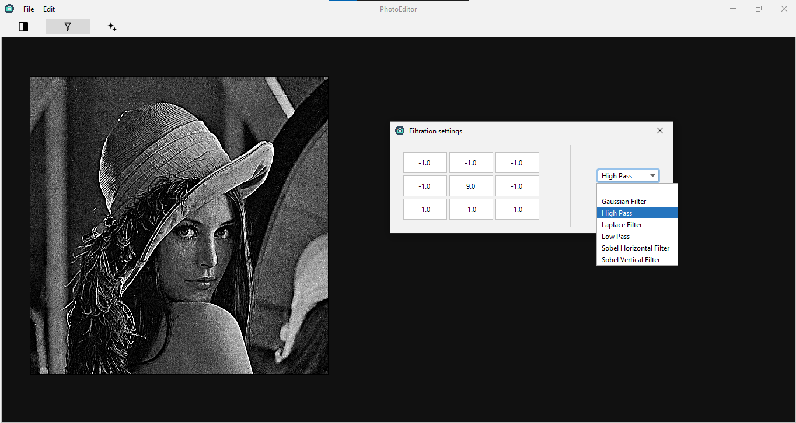
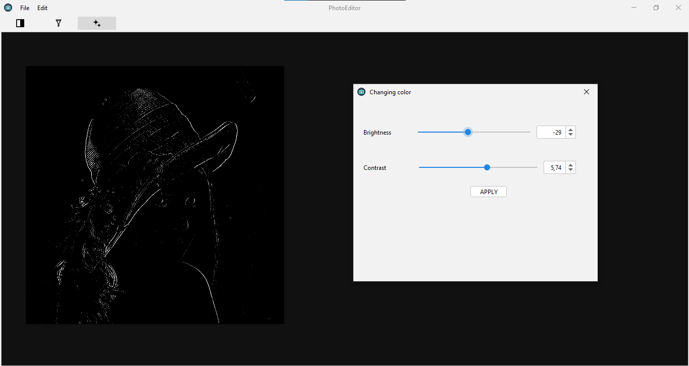

# Photo Editor

Photo editor GUI application made with Java Swing library. The application allows to upload a jpg/png photo and compute a few photo processing operations:
- conversion to grayscale
- change brightness and contrast
- linear filtration (using predefined filters or own filter by providing a convolution filter mask)
- moving and zooming around the canvas
- undo/redo operations
- saving the photo to the jpg format file

## Run
```
git clone https://github.com/ksalekk/photo-editor.git
cd ./photo-editor
java -jar photo-editor.jar
```
The app uses Java Swing and external FlatLaf library (https://www.formdev.com/flatlaf/).

## Demo
Brightness and contrast adjustment


Conversion to grayscale + brightness and contrast adjustment


Conversion to grayscale + filtration with the Laplace filter


Conversion to grayscale + filtration with the highpass filter


Conversion to grayscale + filtration with the Laplace filter + brightness and contrast adjustment



